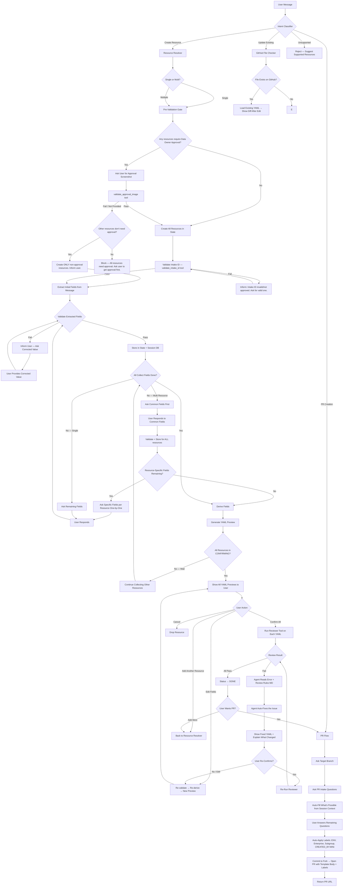
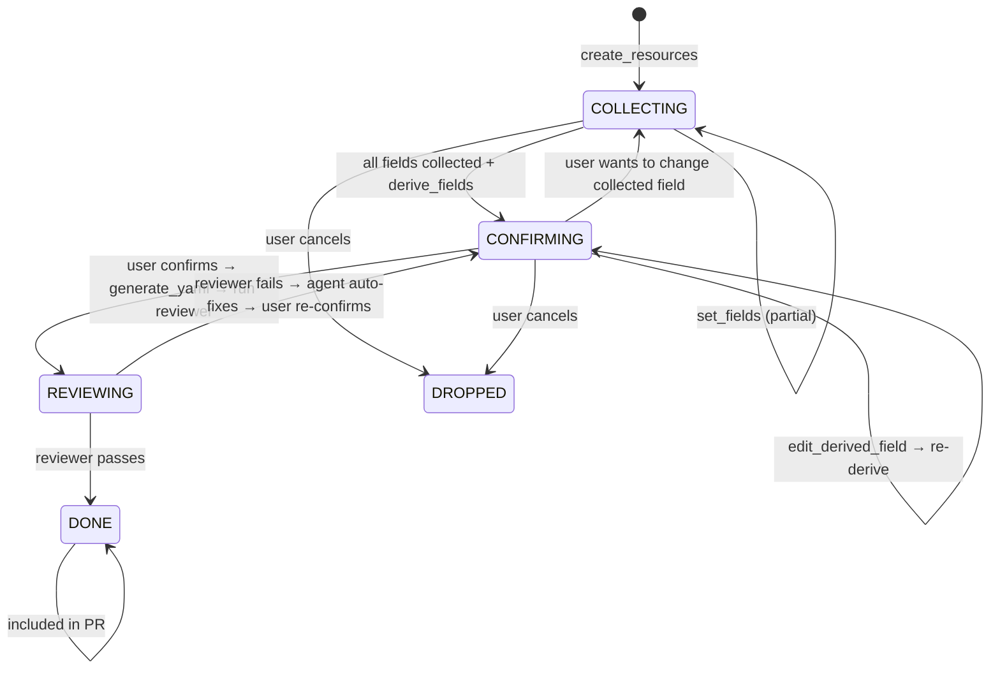
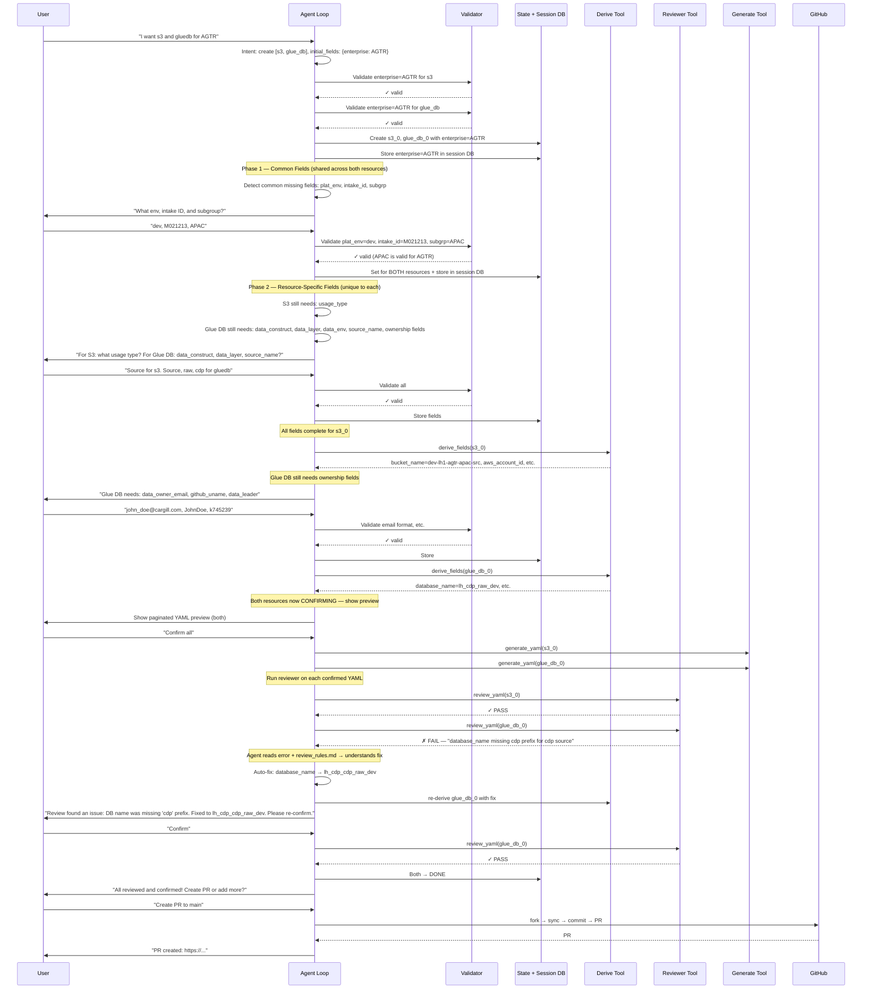
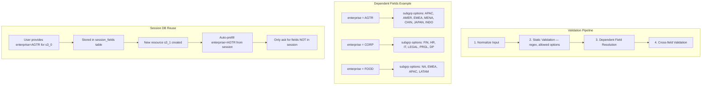
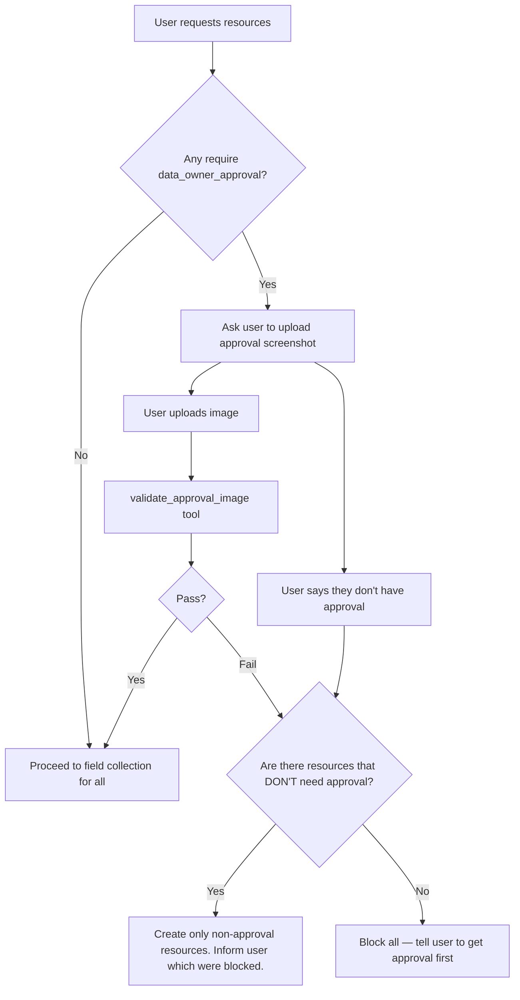
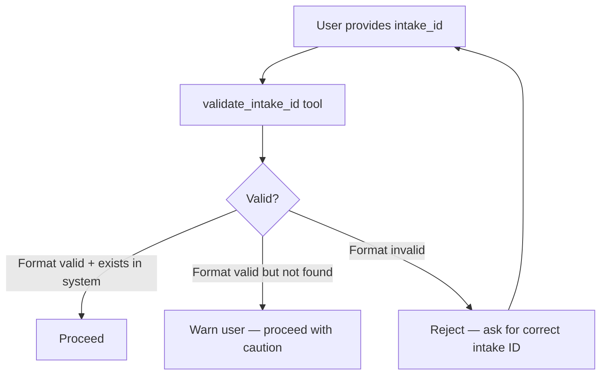
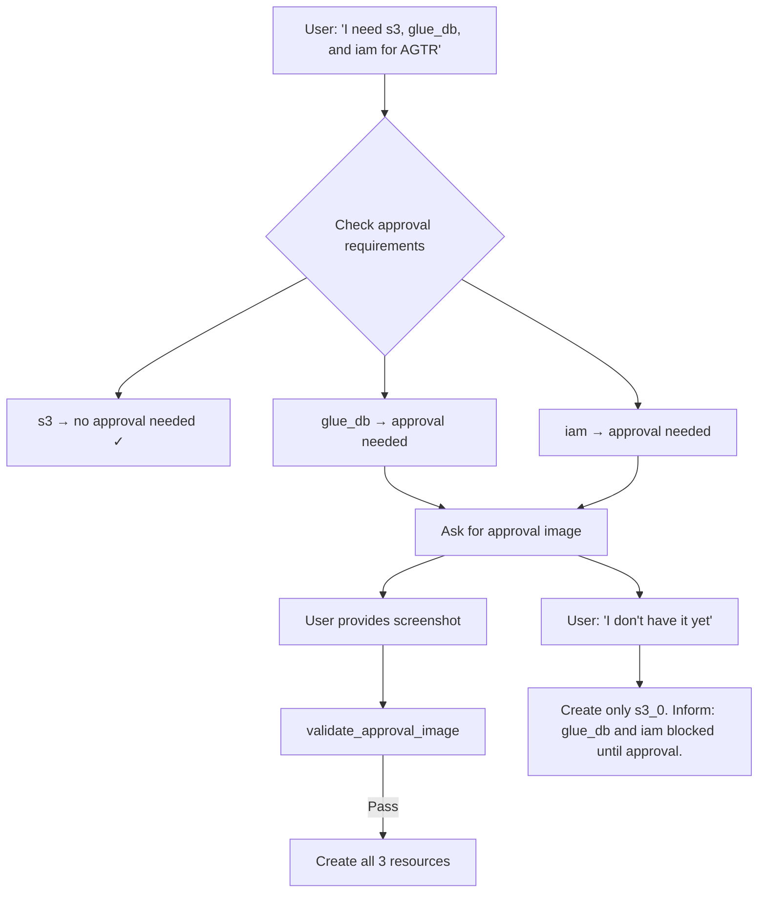
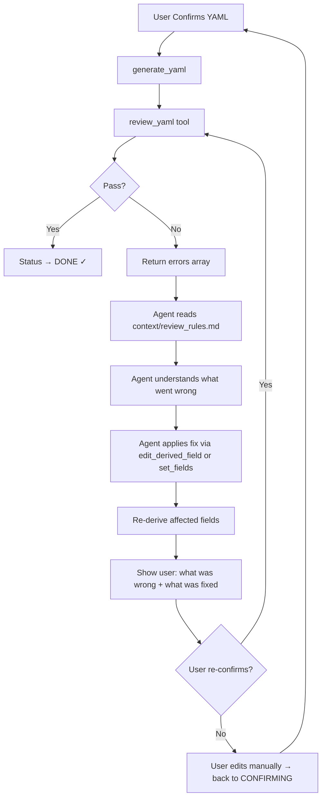
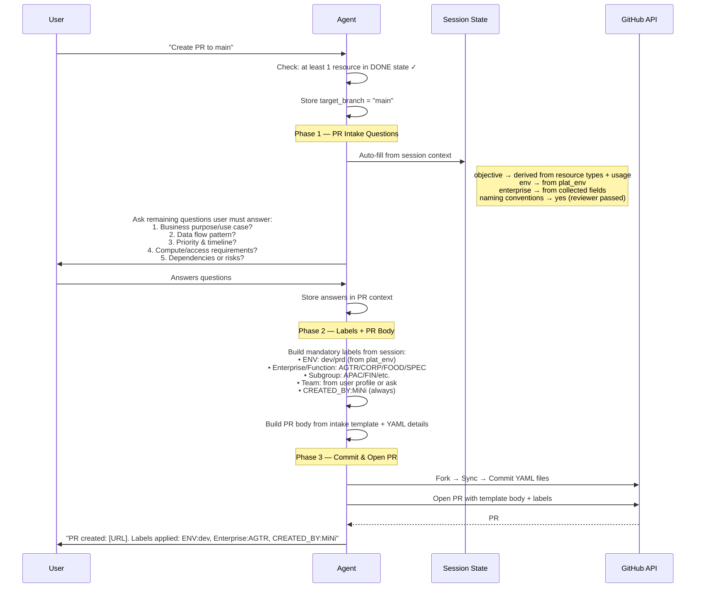

# MiNi Agent — Refined Architecture & Workflow

## Overview

MiNi is a conversational agent that provisions AWS infrastructure (S3, Glue DB, IAM, etc.) through natural language chat. It produces validated YAML configs and commits them as PRs to a GitHub Enterprise repo.

---

## High-Level Conversation Flow



---

## Resource Lifecycle — State Machine



**Key Rules:**
- Validation runs on EVERY `set_fields` call before storing
- Session DB stores shared field values for reuse across resources
- Dependent field options are re-evaluated when parent field changes
- YAML preview is shown ONLY when ALL active resources reach CONFIRMING
- After user confirms, reviewer tool runs automatically — NOT directly to DONE
- If reviewer fails: agent reads the error + `context/review_rules.md` to understand WHY, auto-fixes, shows the fix to user for re-confirmation
- PR creation requires at least one DONE resource (i.e., reviewer-passed)

---

## Module Architecture

```mermaid
flowchart LR
    subgraph Config Layer
        RC[config/resources/*.yaml]
        AC[config/accounts.yaml]
        SC[config/settings.yaml]
        VR[config/validations/]
    end
    
    subgraph Context Layer
        SP[context/system.md]
        RR[context/review_rules.md]
        RM[context/resources/*.md]
    end
    
    subgraph Tools Layer
        IT[intent_tools.py]
        ST[session_tools.py]
        FT[field_tools.py]
        DT[derive_tools.py]
        VT[validate_tools.py]
        RT[reviewer_tools.py]
        GT[generate_tools.py]
        PT[pr_tools.py]
        GH[github_tools.py]
    end
    
    subgraph Agent Layer
        AL[agent/loop.py]
        CB[agent/context_builder.py]
        GD[agent/guardrails.py]
    end
    
    subgraph State Layer
        SS[models/state.py]
        DB[db/repository.py]
    end
    
    subgraph API Layer
        AP[api.py]
    end
    
    AP --> AL
    AL --> CB
    AL --> GD
    AL --> Tools Layer
    CB --> Context Layer
    RT -.->|reads on failure| RR
    Tools Layer --> Config Layer
    Tools Layer --> State Layer
    GD --> State Layer
```

---

## Multi-Resource Sequence



---

## Validation & Session Reuse



---

## Pre-Validation Gates

Before field collection begins, two validation gates may apply depending on the resources requested.

### Gate 1: Data Owner Approval (Image Validation)

Some resources require proof of data owner approval before provisioning can begin. This is configured per resource type in its YAML config.



**Config per resource:**
```yaml
# In config/resources/glue_db.yaml (example)
pre_validations:
  - type: data_owner_approval
    required: true
    description: "Screenshot of data owner approval from intake system"

# In config/resources/s3.yaml (example — does NOT require approval)
pre_validations: []
```

**Tool interface:**
```
validate_approval_image(image_data: str, resource_types: list[str]) → {
  "valid": true/false,
  "reason": "Approval screenshot verified — shows approved status for intake M021213",
  "approved_for": ["glue_db", "iam"],  # which resource types this covers
  "missing_for": []
}
```

**Behavior:**
- Image is uploaded by user (base64 or file URL in chat)
- Tool uses LLM vision or pattern matching to verify the screenshot shows an approved intake
- If valid → all gated resources proceed
- If invalid or not provided → only un-gated resources are created (e.g., S3 doesn't need approval, so it continues)
- Blocked resources are NOT created in state at all — user is told to come back when they have approval

### Gate 2: Intake ID Validation

The intake ID must be validated before any field collection begins. This ensures the request is tracked and approved in the intake system.



**Tool interface:**
```
validate_intake_id(intake_id: str) → {
  "valid": true/false,
  "status": "approved" | "pending" | "not_found" | "invalid_format",
  "message": "Intake M021213 is approved and in Ready for Design state",
  "intake_details": {
    "requestor": "John Doe",
    "enterprise": "AGTR",
    "approved_date": "2026-06-15"
  }
}
```

**Behavior:**
- First validates format (regex: `^[MI]\d+$`)
- Then optionally checks against an external intake system API (if configured)
- If intake is approved → proceed, also pre-fill fields from intake details if available
- If not found → warn user but allow proceeding (system may be out of sync)
- If format invalid → reject, ask again

**Config:**
```yaml
# In config/settings.yaml
intake_validation:
  enabled: true
  format_regex: "^[MI]\\d+$"
  external_api: null  # future: URL to intake system API
  allow_proceed_on_not_found: true  # warn but don't block
```

### Multi-Resource with Mixed Approval Requirements



---

## Refinements Needed

### 1. New Files to Create

| File | Purpose |
|------|---------|
| `tools/validate_tools.py` | Dedicated validation engine — normalize → static check → dependent check → cross-field |
| `tools/pre_validate_tools.py` | **Pre-validation gates** — `validate_approval_image` (image input) + `validate_intake_id` (format + external check) |
| `tools/reviewer_tools.py` | **Reviewer tool** — runs business-rule checks on confirmed YAML. Returns pass/fail + errors. |
| `tools/github_tools.py` | Check if file exists on GitHub, fetch existing YAML for update flow |
| `config/validations/dependent_fields.yaml` | Declarative dependent field mappings (enterprise → subgrp options) |
| `context/review_rules.md` | **Review rules reference** — error codes, explanations, fix strategies. Agent reads this when review fails to understand WHY and how to fix. |
| `agent/guardrails.py` | Extract guardrail logic from loop.py into a dedicated module |
| `db/schema.sql` → add `session_fields` table | Stores field values at session level for cross-resource reuse |

### 2. Files to Refine

| File | Changes |
|------|---------|
| `context/system.md` | Add: supported resource declaration, multi-resource orchestration rules, "wait for all CONFIRMING" rule, update/edit flow instructions |
| `config/settings.yaml` | Add: `supported_resources` list with aliases (bucket→s3, database→glue_db), so LLM knows what it can/can't handle |
| `config/resources/s3.yaml` | Add: `dependent_fields` section, `session_reuse: true` flag per field, field `group` tags for common-field detection |
| `config/resources/glue_db.yaml` | Same: dependent_fields, session_reuse flags, field groups |
| `tools/field_tools.py` | Enhance `set_fields` to: (a) validate before storing, (b) write to session_fields DB, (c) resolve dependent options dynamically |
| `tools/session_tools.py` | Enhance `create_resources` to: (a) prefill from session_fields first, (b) respect field groups for common-field batching |
| `agent/loop.py` | Extract guardrails, add: "block YAML gen until all CONFIRMING" guardrail, "re-derive on edit" guardrail |
| `api.py` | Enhance `_build_structured` to only show `yaml_preview` when ALL active are CONFIRMING |

### 3. New Concepts

| Concept | Description |
|---------|-------------|
| **Field Groups** | Tag fields as `group: identity`, `group: ownership`, etc. Common groups across resource types are asked together first. |
| **Session Fields DB** | A table `session_fields(session_id, field_name, value)` storing every field value in the session. On new resource creation, auto-fill from this. |
| **Dependent Field Resolution** | When `enterprise` is set, dynamically filter `subgrp` options. Config-driven: `depends_on: enterprise_or_func_name` with a mapping per parent value. |
| **Validation Pipeline** | 4-stage: normalize → static (regex/options) → dependent (filtered options) → cross-field (custom rules). Returns `{valid: bool, errors: [...]}` |
| **Reviewer Tool (Quality Gate)** | After user confirms YAML, a reviewer tool runs business-rule checks. If PASS → DONE. If FAIL → agent reads `context/review_rules.md` to understand why, auto-fixes, shows fix to user, re-confirms. Loop until pass. |
| **Review Rules MD** | A reference document (`context/review_rules.md`) that maps error codes to explanations and fix strategies. The agent reads this ONLY when a review fails — not injected into every prompt. |
| **REVIEWING State** | New resource status between CONFIRMING and DONE. Resource stays here until reviewer passes. Prevents PR creation on un-reviewed YAML. |
| **Multi-Resource Field Batching** | Phase 1: common fields (same `group` tag across all requested resources) asked once for all. Phase 2: resource-specific remaining fields asked one resource at a time. |
| **"Wait for All" Rule** | YAML preview + confirmation flow is BLOCKED until every active (non-DROPPED) resource reaches CONFIRMING. This is a code guardrail, not prompt-dependent. |
| **Update Flow** | When user requests a resource, check GitHub for existing file with same derived name. If found, load it, let user edit, re-derive, and commit as update (not new file). |

---

## Proposed Directory Structure (Refined)

```
backend_v3/
├── api.py                          # FastAPI endpoints
├── auth.py                         # GitHub OAuth
├── console.py                      # CLI chat
├── agent/
│   ├── loop.py                     # ReAct loop (cleaned — guardrails extracted)
│   ├── context_builder.py          # System prompt assembly
│   └── guardrails.py              # NEW: all code guardrails in one place
├── config/
│   ├── settings.yaml               # Supported resources, aliases, agent params
│   ├── accounts.yaml               # AWS account mapping
│   ├── pr_template.yaml            # NEW: PR intake questions, auto-fill rules, label config
│   ├── resources/
│   │   ├── s3.yaml                 # S3 spec (with groups, dependent_fields, session_reuse)
│   │   ├── glue_db.yaml            # Glue DB spec
│   │   └── iam.yaml                # Future: IAM spec
│   └── validations/
│       └── dependent_fields.yaml   # NEW: enterprise→subgrp mappings etc.
├── context/
│   ├── system.md                   # Main system prompt (refined)
│   ├── review_rules.md             # NEW: review error codes, explanations, fix strategies
│   └── resources/
│       ├── s3.md                   # S3 derivation context for LLM
│       └── glue_db.md              # Glue DB context for LLM
├── db/
│   ├── connection.py
│   ├── repository.py               # CRUD (+ session_fields table ops)
│   └── schema.sql                  # Tables (+ session_fields)
├── models/
│   └── state.py                    # Session, Resource, Message, ResourceStatus
├── services/
│   └── llm.py                      # OpenAI-compatible client
└── tools/
    ├── registry.py                 # Tool map + schemas
    ├── session_tools.py            # create/drop/clone resources, get_state
    ├── pre_validate_tools.py       # NEW: approval image + intake ID validation (gates)
    ├── field_tools.py              # set_fields, get_resource_info, edit_derived
    ├── validate_tools.py           # NEW: validation pipeline
    ├── reviewer_tools.py           # NEW: post-confirmation business-rule review
    ├── derive_tools.py             # Derivation logic
    ├── generate_tools.py           # YAML generation
    ├── pr_tools.py                 # PR creation (fork → commit → PR)
    ├── github_tools.py             # NEW: check file exists, fetch YAML for updates
    └── preference_tools.py         # User profile
```

---

## Tool Inventory (Refined)

### Current Tools (keep)
| Tool | Purpose |
|------|---------|
| `get_session_state` | Auto-injected session state |
| `create_resources` | Create 1+ resources with initial fields |
| `drop_resource` | Cancel a resource |
| `clone_resource` | Copy from existing with overrides |
| `set_fields` | Set collected fields (now with validation) |
| `get_resource_info` | Load .md context for LLM |
| `edit_derived_field` | User override on derived fields |
| `derive_fields` | Compute derived values |
| `generate_yaml` | Produce final YAML |
| `create_pr` | PR workflow |
| `update_user_profile` | Behavioral observations |

### New Tools (to add)
| Tool | Purpose |
|------|---------|
| `validate_approval_image` | **Pre-validation** — accepts image (base64/URL), uses LLM vision to verify data owner approval screenshot. Returns pass/fail + which resource types are approved. |
| `validate_intake_id` | **Pre-validation** — validates intake ID format and optionally checks external intake system. Returns status + pre-fillable fields from intake details. |
| `validate_fields` | Explicit validation call (normalize → static → dependent → cross-field). Returns `{valid, errors, warnings}` |
| `review_yaml` | **Reviewer tool** — takes confirmed YAML, runs business-rule checks (naming conventions, cross-field consistency, account correctness). Returns `{pass: bool, errors: [...], suggestions: [...]}` |
| `check_existing_resource` | Check if a YAML file with the derived name already exists on GitHub. Returns file content if found. |
| `get_common_fields` | Given a list of resource_types, return the fields they share (for batched asking) |

---

## Reviewer Tool — Deep Dive

### Purpose
The reviewer is a **post-confirmation quality gate** between user confirmation and DONE status. It catches business-rule violations that simple field validation can't (e.g., naming convention compliance, cross-field consistency, account-to-enterprise matching).

### Flow


### What the Reviewer Checks

| Check | Resource | Rule |
|-------|----------|------|
| Naming convention | S3 | bucket_name matches `{env}-{acct_abbr}-{entity}[-{subgrp}]-{suffix}` pattern |
| Naming convention | Glue DB | database_name follows `lh_` prefix for Source, contains source_name, snake_case only |
| CDP prefix | Glue DB | If source_name=cdp, database_name must contain `cdp` after `lh_` |
| Account correctness | Both | aws_account_id matches the expected account for usage_type/data_construct + enterprise + plat_env |
| Region consistency | Both | region/aws_region must be `us-east-1` |
| S3 location format | Glue DB | database_s3_location must start with correct bucket, have correct path structure, end with `/` |
| Subgroup for CORP | Both | If enterprise=CORP, subgroup must not be empty |
| Field completeness | Both | All required fields present and non-empty |
| Quoting rules | Both | aws_account_id must be quoted as string (not number) in final YAML |

### Reference File: `context/review_rules.md`

A new `.md` file the agent reads when a review fails. Contains:
- Each rule's error code → human explanation of WHY it matters
- Common fix strategies per error type
- Examples of correct vs incorrect YAML for each rule

This allows the LLM to understand the error semantically, not just pattern-match.

### Reviewer Tool Interface

```
review_yaml(resource_id: str) → {
  "pass": true/false,
  "resource_id": "s3_0",
  "errors": [
    {
      "code": "NAMING_CONVENTION",
      "field": "bucket_name",
      "message": "Expected pattern: prd-lh1-agtr-apac-src, got: prd-lh1-agtr-src",
      "severity": "error",
      "fix_hint": "Subgroup 'APAC' is set but not included in bucket_name"
    }
  ],
  "warnings": [
    {
      "code": "DESCRIPTION_GENERIC",
      "field": "bucket_description",
      "message": "Description is very generic — consider being more specific",
      "severity": "warning"
    }
  ]
}
```

### Agent Behavior on Review Failure
1. Agent receives error array from `review_yaml`
2. Agent calls `get_resource_info` with type `review_rules` to load `context/review_rules.md`
3. Agent matches error codes to rules in the MD → understands the root cause
4. Agent determines fix: either `edit_derived_field` (if derived field is wrong) or `set_fields` (if collected field needs correction)
5. Agent applies fix → triggers re-derive if needed
6. Agent presents to user: "Review found X issue. I fixed it by doing Y. Here's the updated YAML — please confirm."
7. On re-confirm → reviewer runs again (loop until pass)

---

## Guardrails (Code-Enforced)

| # | Guardrail | When | Action |
|---|-----------|------|--------|
| 1 | Auto-inject state | Every turn start | Inject fresh `get_session_state` result as system message |
| 2 | Auto-derive | After `set_fields` returns `collection_complete=true` | Call `derive_fields` automatically |
| 3 | Block premature YAML preview | `_build_structured` in api.py | Only show `yaml_preview` when ALL active resources are CONFIRMING |
| 4 | Block generate_yaml in same turn | After `create_resources` call | Prevent `generate_yaml` from firing in the same agent loop iteration |
| 5 | Validate before store | Inside `set_fields` | Run validation pipeline before writing to state |
| 6 | Re-derive on edit | After `edit_derived_field` or field change in CONFIRMING | Auto-re-derive all derived fields |
| 7 | Session field persistence | After every successful `set_fields` | Write field values to `session_fields` table for reuse |
| 8 | Auto-review after confirm | After `generate_yaml` completes | Automatically call `review_yaml` — block DONE status until reviewer passes |
| 9 | Block PR without review | Inside `create_pr` | Reject if any resource is in REVIEWING state (not yet passed) |

---

## Update Existing Resource Flow (Extension)

```mermaid
flowchart TD
    U[User: "Update my S3 bucket prd-lh1-agtr-src"] --> IC{Intent: Update}
    IC --> GH[github_tools: check_existing_resource]
    GH --> Found{File found on GitHub?}
    Found -->|Yes| Load[Load existing YAML into state as CONFIRMING]
    Found -->|No| Err[Tell user: resource not found, offer to create new]
    Load --> Edit[Show YAML editor with current values]
    Edit --> UserEdit[User modifies fields]
    UserEdit --> Val[Validate changed fields]
    Val -->|Pass| ReDer[Re-derive with new inputs]
    Val -->|Fail| AskFix[Ask user to fix]
    ReDer --> Preview[Show updated YAML preview]
    Preview --> Confirm[User confirms]
    Confirm --> Done[Status DONE — ready for PR]
    Done --> PR[PR replaces existing file]
```

---

## PR Creation Flow — Detailed

When the user says "create PR" / "submit" / "raise PR", the flow is NOT just commit-and-open. There are mandatory intake questions and labels required by the MIW review process.

### PR Flow Sequence



### PR Intake Questions (Mandatory)

These questions map to the MIW PR submission template. The agent asks them ONCE per PR (not per resource).

| # | Question | Auto-Fill Strategy |
|---|----------|-------------------|
| 1 | **What is the objective of this request?** | Auto-generate from resource types + usage: "Provisioning S3 source bucket and Glue database for AGTR APAC data ingestion" |
| 2 | **What is the data flow or usage pattern?** | Can infer from usage_type/data_construct: Source→"Batch ingestion", DataProduct→"Curated data serving". Otherwise ask user. |
| 3 | **What is the priority and timeline?** | Always ask — cannot infer |
| 4 | **Has intake been approved? Naming conventions followed?** | Auto-fill: "Yes, intake {intake_id} approved. Naming conventions verified by automated reviewer." |
| 5 | **What are compute and access requirements?** | Ask user unless trivial (e.g. S3-only PRs → "N/A - storage only") |
| 6 | **Dependencies, risks, or special considerations?** | Always ask — cannot infer |

**Smart behavior:** If the agent can fully auto-fill a question from session context, it shows the auto-filled answer and asks user to confirm rather than making them type it.

### Mandatory PR Labels

Labels are auto-applied based on session data. The agent does NOT ask the user for these — they are derived.

| Label | Source | Example |
|-------|--------|---------|
| `ENV:{plat_env}` | From `plat_env` field | `ENV:dev`, `ENV:prd` |
| `Enterprise:{name}` | From `enterprise_or_func_name` | `Enterprise:AGTR` |
| `Subgroup:{name}` | From `enterprise_or_func_subgrp_name` (if set) | `Subgroup:APAC` |
| `Team:{team}` | From user profile or ask once | `Team:DataEng` |
| `CREATED_BY:MiNi` | Always added | Identifies bot-created PRs |
| `Wave:{wave}` | Ask user if not known | `Wave:W3` |

**Note:** If multiple resources span different enterprises or envs, apply ALL relevant labels (e.g., both `ENV:dev` and `Enterprise:AGTR` + `Enterprise:CORP`).

### PR Body Template

The `create_pr` tool formats the PR description using this template:

```markdown
### Request Intake Template

#### 1. What is the objective of this request?
> {auto_or_user_answer_1}

#### 2. What is the data flow or usage pattern?
> {auto_or_user_answer_2}

#### 3. What is the priority and timeline?
> {user_answer_3}

#### 4. Has the intake request been approved? Naming conventions followed?
> {auto_answer_4}

#### 5. What are the compute and access requirements?
> {auto_or_user_answer_5}

#### 6. Dependencies, risks, or special considerations?
> {user_answer_6}

---

## Resources in this PR

### {resource_type} — {resource_name}
- **Intake ID:** {intake_id}
- **File:** `{file_path}`

```yaml
{yaml_content}
`` `

---
_This PR was automatically generated by MiNi._
```

### Config for PR Questions: `config/pr_template.yaml`

A new config file to make the template maintainable:

```yaml
# PR intake questions — asked once per PR submission
intake_questions:
  - id: objective
    question: "What is the objective of this request? (business purpose/use case)"
    auto_fill: "Provisioning {resource_types} for {enterprise} {subgroup} {usage_summary}"
    required: true
  
  - id: data_flow
    question: "What is the data flow or usage pattern? (batch/streaming/hybrid/ad-hoc)"
    auto_fill_map:
      Source: "Batch ingestion"
      DataProduct: "Curated data serving"
      Scripts: "ETL processing"
      EngAssets: "Engineering artifacts"
    required: true
  
  - id: priority
    question: "What is the priority and timeline? (MIW SLA is 72 hours)"
    auto_fill: null  # always ask
    required: true
  
  - id: intake_approved
    question: "Has the intake request been approved and in 'Ready for Design' state?"
    auto_fill: "Yes, intake {intake_id} approved. Naming conventions verified by automated reviewer."
    required: true
  
  - id: compute_access
    question: "What are the compute and access requirements?"
    auto_fill_map:
      s3: "N/A - storage provisioning only"
      glue_db: "Standard Glue catalog access"
      iam: "Role-based access as specified"
    required: true
  
  - id: dependencies
    question: "Are there any dependencies, risks, or special considerations?"
    auto_fill: null  # always ask
    required: true

# Labels auto-derived from session context
labels:
  - template: "ENV:{plat_env}"
    source: plat_env
  - template: "Enterprise:{enterprise_or_func_name}"
    source: enterprise_or_func_name
  - template: "Subgroup:{enterprise_or_func_subgrp_name}"
    source: enterprise_or_func_subgrp_name
    skip_if_empty: true
  - template: "CREATED_BY:MiNi"
    static: true
  - template: "Wave:{value}"
    source: ask_user
    question: "Which wave is this for? (e.g. W1, W2, W3)"

# Team label — stored in user profile after first ask
team_label:
  template: "Team:{value}"
  source: user_profile.team
  fallback_question: "What team should this PR be labeled with?"
```

---

## Config Enhancements Needed

### `config/settings.yaml` — Add Supported Resources + Aliases

```yaml
supported_resources:
  - type: s3
    display: "S3 Bucket"
    aliases: [bucket, s3 bucket, storage, s3]
  - type: glue_db
    display: "Glue Database"
    aliases: [database, glue database, gluedb, glue db, catalog]
  - type: iam
    display: "IAM Role"
    aliases: [role, iam role, permissions]

unsupported_message: |
  I can only help with: S3 Buckets, Glue Databases, and IAM Roles.
  Would you like to create one of these?
```

### `config/resources/s3.yaml` — Add Field Groups + Dependencies

```yaml
collect_fields:
  - name: plat_env
    group: identity          # ← shared across all resource types
    session_reuse: true      # ← auto-fill from session DB
    ...
  - name: enterprise_or_func_name
    group: identity
    session_reuse: true
    ...
  - name: enterprise_or_func_subgrp_name
    group: identity
    session_reuse: true
    depends_on: enterprise_or_func_name   # ← dependent field
    ...
```

### `config/validations/dependent_fields.yaml` — Dependent Options

```yaml
# When enterprise_or_func_name has a value, restrict subgrp options
enterprise_or_func_subgrp_name:
  depends_on: enterprise_or_func_name
  options_by_parent:
    AGTR: [APAC, AMER, EMEA, MENA, CHIN, JAPAN, INDO, ""]
    CORP: [FIN, HR, IT, LEGAL, PRGL, DP, ""]
    FOOD: [NA, EMEA, APAC, LATAM, ""]
    SPEC: [NI, HC, ""]
```

### `db/schema.sql` — Add Session Fields Table

```sql
CREATE TABLE IF NOT EXISTS session_fields (
    session_id TEXT NOT NULL,
    field_name TEXT NOT NULL,
    field_value TEXT NOT NULL,
    updated_at TEXT DEFAULT (datetime('now')),
    PRIMARY KEY (session_id, field_name)
);
```

---

## Summary of Changes

| Category | What | Why |
|----------|------|-----|
| **New tool** | `pre_validate_tools.py` | Pre-validation gates: approval image (vision) + intake ID check |
| **New tool** | `validate_tools.py` | Centralized 4-stage field validation pipeline |
| **New tool** | `reviewer_tools.py` | Post-confirmation business-rule review gate before DONE |
| **New tool** | `github_tools.py` | Check if resource file exists for update flow |
| **New config** | `validations/dependent_fields.yaml` | Declarative parent→child field option filtering |
| **New config** | `config/pr_template.yaml` | PR intake questions, auto-fill strategies, label definitions |
| **New context** | `context/review_rules.md` | Error codes + explanations for agent to understand review failures |
| **New DB table** | `session_fields` | Cross-resource field reuse within a session |
| **New state** | `REVIEWING` | Between CONFIRMING and DONE — reviewer must pass |
| **New guardrail** | Pre-validation gate | Block gated resources if approval image fails; allow ungated to proceed |
| **New guardrail** | Intake ID validation | Validate format + existence before field collection begins |
| **New guardrail** | Auto-review after confirm | reviewer runs automatically after generate_yaml |
| **New guardrail** | Block PR without review | Can't create PR if resources haven't passed review |
| **New guardrail** | Block YAML preview until all CONFIRMING | Prevents partial confirmation |
| **Enhance** | `create_pr` tool | Now collects intake questions, auto-fills from context, applies labels, formats PR body using template |
| **Enhance** | `set_fields` | Validate → store → write session DB |
| **Enhance** | `create_resources` | Prefill from session_fields, detect common fields |
| **Enhance** | `settings.yaml` | Supported resource list with aliases + intake validation config |
| **Enhance** | Resource YAMLs | `group`, `session_reuse`, `depends_on`, `pre_validations` per resource |
| **Extract** | `agent/guardrails.py` | Clean separation of guardrail logic from loop |
| **Enhance** | `system.md` | Multi-resource rules, wait-for-all, reviewer flow, PR intake flow, pre-validation gates |
